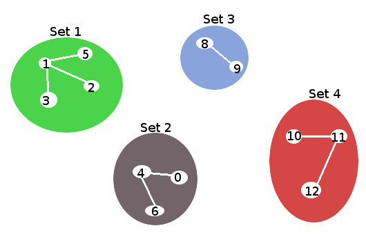
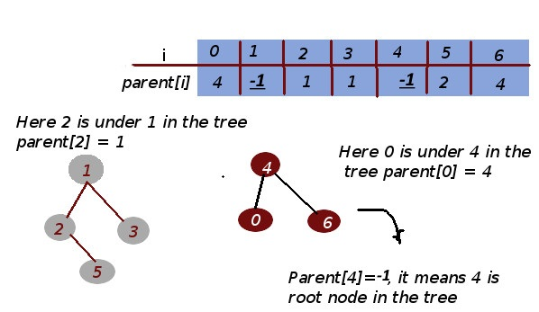
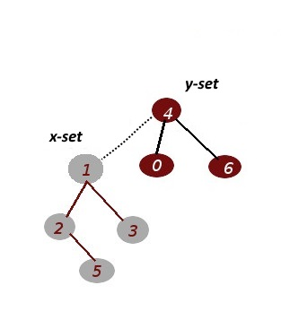

### Disjoint-set data structure Illustration


### Disjoint Set Operations:
#### 1) find_parent() – Determine which set an item belongs to


**Implement**
```
# Find root parent (represent for a subset) of node i in array parent
def find_parent(self, parent,i):
	if parent[i] == -1:
		return i
	if parent[i]!= -1:
		# find node parent of node parent[i] in array parent
		 return self.find_parent(parent,parent[i])
```

#### 2) union() – Combine or merge two sets into a single set.

**Implement**
```
# A utility function to do union of two subsets
def union(self, parent, x, y):
	# find root parent of node x
	x_set = self.find_parent(parent, x)
	# find root parent of node y
	y_set = self.find_parent(parent, y)
	# set y_set as parent of x_set
	parent[x_set] = y_set
```

#### Credits
- [Disjoint-set data structure c++ implementation](http://wikistack.com/disjoint-set-data-structure-c-implementation/)