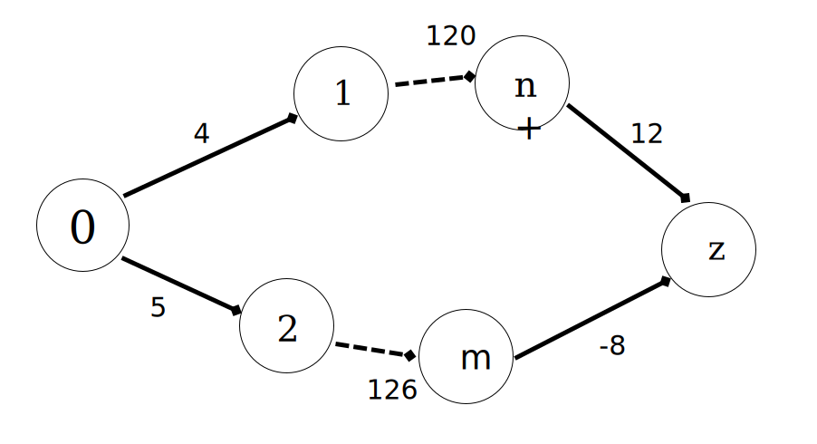
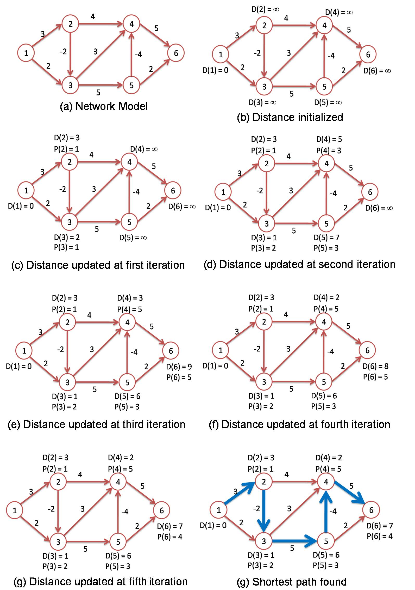
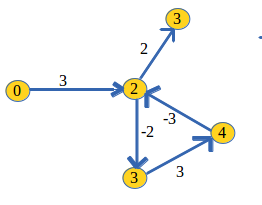

## Idea To Solve The Problem:

**How to find path from node 0 to node z with minimum cost?**

- First, we go throgh the path a: 0 -> 1 -> ... -> n -> z with total cost: 4 + 120 + 12 = 136
- Then, we go throgh the path b: 0 -> 2 -> ... -> m -> z with total cost: 5 + 126 - 8 = 123

123 < 136 so the path b is our answer.

## Bellman Ford's Algorithm:

1) At the initial stage, set the distance to zero for the source node and to infinity for all other nodes.
2) Then at each node, select an adjacent node so that the summation of the distance of the adjacent node and the cost of the link from the adjacent node to its own node is minimized.
3) Set the selected adjacent node to be the previous hop node.

The shortest path can be found after repeating the process for N-1 times (N is the number of nodes in the network)

**Demo**

**Credits**
- http://wikistack.com/shortest-path-problem-with-negative-weights-step-by-step-by-bellman-ford-algorithm/
- http://www.techiedelight.com/single-source-shortest-paths-bellman-ford-algorithm/
- http://www.fedu.uec.ac.jp/~f12utami/research.html

## Operators

### Relaxation Operator
is the steps to path with smallest cost of **Bellman Ford's Algorithm** above

### detect negative cycle operator
In case graph has cycle like this one, Bellman Ford's Algorithm is no longer right

Really, consider path 2->3->4->2, it's cost is (-2 + 3 -3 ) = -2, the cost at 2 is -2
So, if we go through 0->2, the cost will be 3 - 2 = 1
If we go through 2->3->4->2 a gain, it costs 1 - 2 = -1
And again and again, the cost will be reduced and reduced

To detect there's a circle in graph, we run Relaxation Operator once again, if there's a cost is smaller and need to update that is the circle.
We will through an error to inform that Bellman Ford's Algorithm can't solve the problem in this case.
