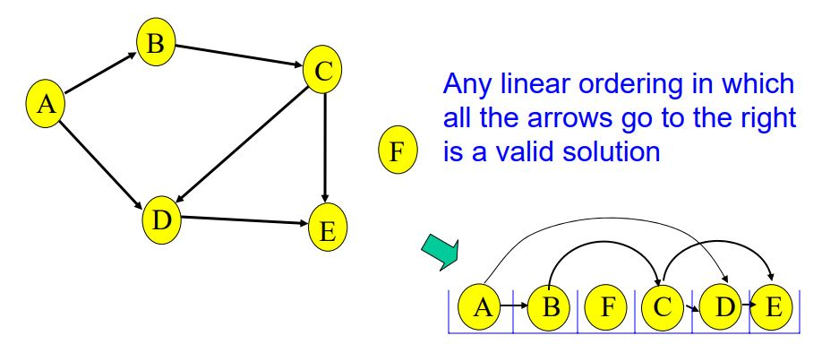
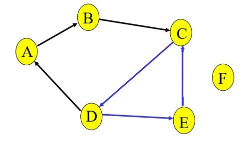

### Problem
Given directed graph (a), how to change it into graph (b)?

in which all vertices in a line and direction of all arcs of the graph (arrows) is pointing from left to right.

A changing like that is called **Topological sorting**.

**It's definition is**
```
Topological sorting for Directed Acyclic Graph (DAG) is a linear ordering of vertices such that for every directed edge uv, vertex u comes before v in the ordering. Topological Sorting for a graph is not possible if the graph is not a DAG
```

### Idea To Solve The Problem
In picture above,
A doesn't have any incomming arcs (arrows) so it's first
B has incomming arcs from A, so it's after A
C has incomming arcs from B, so it's after B
And so on ...
Note F doesn't have incomming or outcomming so it can be in any order.

### Special Case
A directed graph with a cycle cannot be topologically sorted.

Why? because C can be after D, D can be after E and then E can be after C => contradict to Topological sorting definition.

### Kahn’s algorithm for Topological Sorting

### Credits
- https://courses.cs.washington.edu/courses/cse373/06sp/handouts/lecture21.pdf
- http://www.geeksforgeeks.org/topological-sorting-indegree-based-solution/
- https://www.hackerearth.com/practice/algorithms/graphs/topological-sort/tutorial/